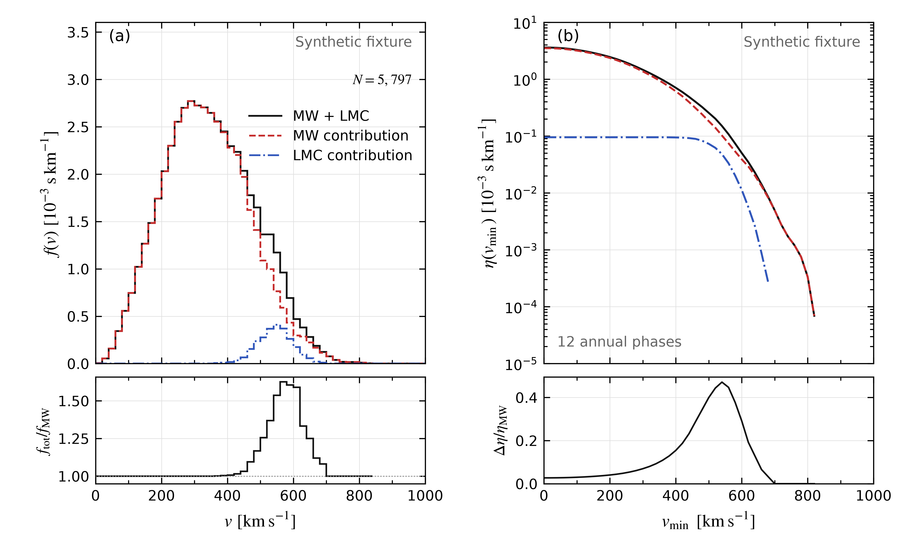

# LMC_AURIGA

Reproducible particle-velocity analysis: explicit physical units and reference frames, chunked HDF5 input, weighted halo observables, and comparable CPU kernels.

The public demonstration is a **synthetic kinematic fixture**, generated locally from prescribed distributions. It contains no Auriga particles and makes no prediction for the real Large Magellanic Cloud (LMC). The project develops analysis methods motivated by [LMC effects on dark-matter direct detection](https://arxiv.org/abs/2302.04281); it does not reproduce that paper's results.



The [showcase](examples/showcase/) includes the underlying CSV tables, configuration and source hashes, and [PDF](examples/showcase/scientific_review.pdf)/[SVG](examples/showcase/scientific_review.svg) figures. Its 20,000-particle, seed-42 fixture has a Gaussian host and a 5% tagged stream before spatial selection. Both labels are bookkeeping for a toy model. [Methods and limitations](docs/methods.md) explain exactly what each curve measures.

The figure presentation follows the panel hierarchy and population colours of figures 4 and 6 in the [LMC paper](https://arxiv.org/abs/2302.04281): compact upper panels, shared-axis comparison strips, and black/red/blue curves. It retains this package's observer frame and common normalization, with no invented error bands. The [supplementary speed-tail figure](examples/showcase/speed_tail.pdf) completes the observable set. See the [figure specification](docs/figure_style.md) for exact conventions.

## Run the demonstration

Use Python 3.10 or newer in a virtual environment:

```sh
python -m venv .venv
```

Activate it with `.venv\Scripts\Activate.ps1` in Windows PowerShell, or `source .venv/bin/activate` on Linux/macOS. Then:

```sh
python -m pip install -e ".[plot,test]"
python -m lmc_auriga demo --output results/demo --particles 20000 --seed 42 --figures
python -m pytest -q
```

Choose a fresh output directory when repeating `demo` or `analyze`; existing snapshots and analysis tables are protected against replacement. The default analysis selects the inclusive 6–10 kpc shell, uses 12 equally spaced annual phases and a circular speed of 220 km/s, and applies no angular cone. `lmc-auriga` is also available as an installed command.

## What the pipeline produces

| Output | Meaning |
| --- | --- |
| `speed_distribution.csv` | Annual phase-mean speed density; MW and LMC contributions share the total normalization |
| `observables.csv` | Strict speed-tail probability and empirical mean inverse speed, evaluated directly from particles |
| `anisotropy.csv` | Centered, weighted host-frame velocity anisotropy for each component |
| `report.json` | Selection, observer basis, phases, weighting, histogram overflow, environment, input hash, and code hashes |
| `scientific_review.pdf/.svg/.png`, `speed_tail.pdf/.svg/.png`, `caption.txt` | Main figure with comparison panels, supplementary tail figure, and scientific caption |

Figures can be regenerated from saved tables without rereading particle data:

```sh
python -m lmc_auriga figures results/demo
```

To regenerate the committed synthetic showcase, run `python scripts/reproduce_showcase.py`. This deliberately replaces the generated tables and figures in `examples/showcase/` and keeps the temporary particle snapshot out of the public artifacts.

## Analyze documented particle data

The reader accepts this project's [processed HDF5 contract](docs/data_contract.md), with physical kpc and km/s, a declared Galactocentric frame, canonical component tags, and optional positive weights. It does not infer units, recenter galaxies, or silently convert raw Auriga snapshots.

```sh
python -m lmc_auriga inspect data/processed/snapshot.hdf5
python -m lmc_auriga analyze data/processed/snapshot.hdf5 --output results/analysis --shell 6 10 --vc 220 --phases 12 --figures
```

`inspect` checks metadata and array structure; `analyze` validates every data chunk. For real data, establish the original units, galaxy center and bulk velocity, axis convention, component membership, and weight interpretation before preparing the input. No real-data scientific result is validated or distributed with this repository. Consult the [official Auriga release](https://wwwmpa.mpa-garching.mpg.de/auriga/data_new.html) and [conversion guidance](docs/data_contract.md#from-raw-auriga-data).

An [explicit legacy importer](docs/data_contract.md#already-processed-legacy-files) is available when physical units and the host frame are already confirmed. It records that confirmation and the source hash, preserves the original tags, and applies the documented tag mapping without changing coordinates or velocities.

## Performance and validation

```sh
python -m lmc_auriga benchmark --output results/benchmark --counts 1000 10000 100000 --repeats 5 --backends numpy
```

Optional CPU parallelism is available with `python -m pip install -e ".[parallel]"` and `--backends numpy numba`. Measurements use identical inputs, warm-up, numerical parity checks, raw repeated timings, and runtime metadata. The [benchmark protocol](docs/benchmarking.md) measures the observer-speed kernel, including output allocation. It makes no GPU or full-pipeline speedup claim.

The [validation guide](docs/validation.md) links analytic checks, streaming and backend parity tests, and corrections to the historical notebook workflow. Original notebook material is preserved as text in [docs/legacy](docs/legacy/); the supported implementation is `src/lmc_auriga`.

## Scientific context

- [Smith-Orlik et al., *The impact of the Large Magellanic Cloud on dark matter direct detection signals*](https://arxiv.org/abs/2302.04281).
- [Grand et al., *Overview and public data release of the augmented Auriga Project*](https://arxiv.org/abs/2401.08750).
- [Freese, Lisanti & Savage, *Annual Modulation of Dark Matter: A Review*](https://arxiv.org/abs/1209.3339).

Code is distributed under the [MIT license](LICENSE). External simulation data retain their own access and citation requirements.
